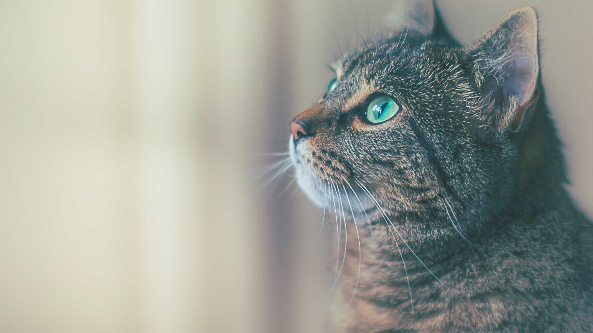
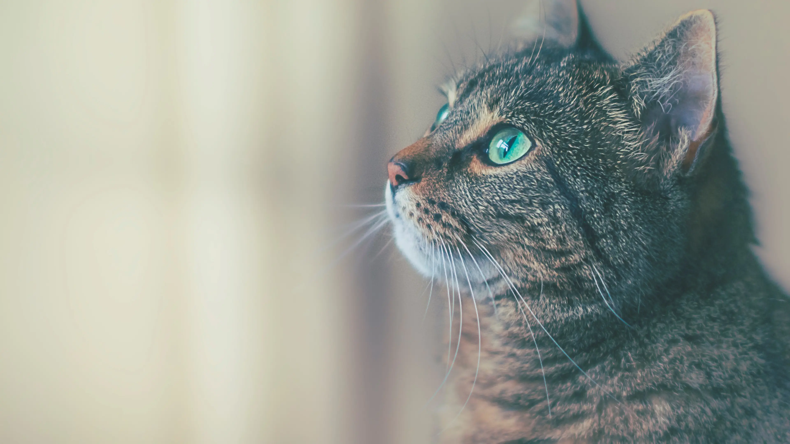
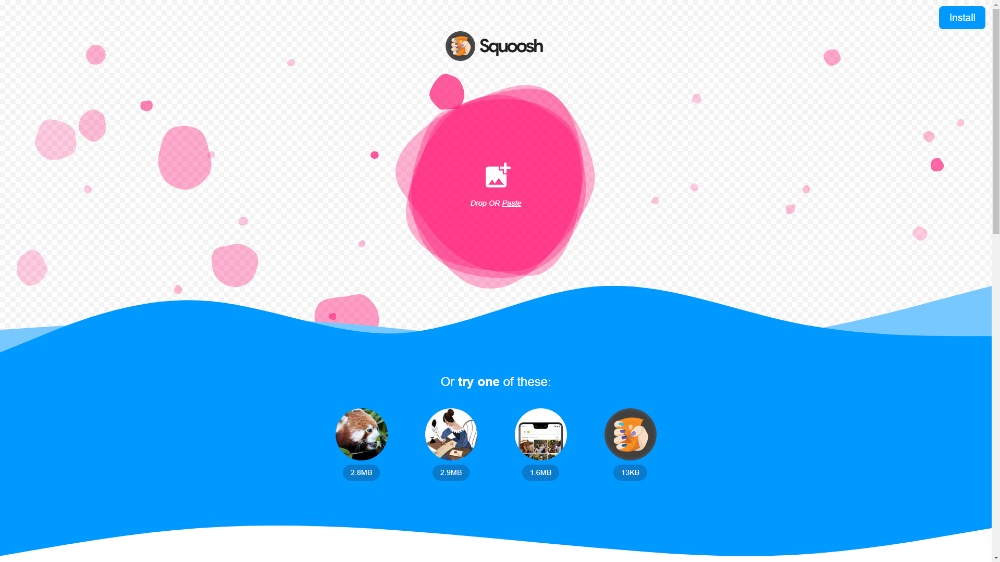
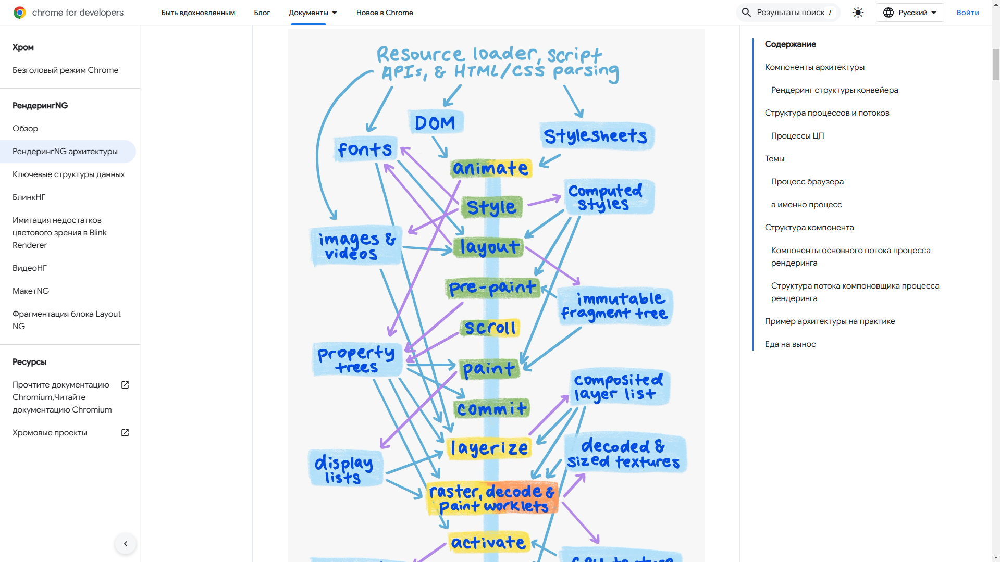
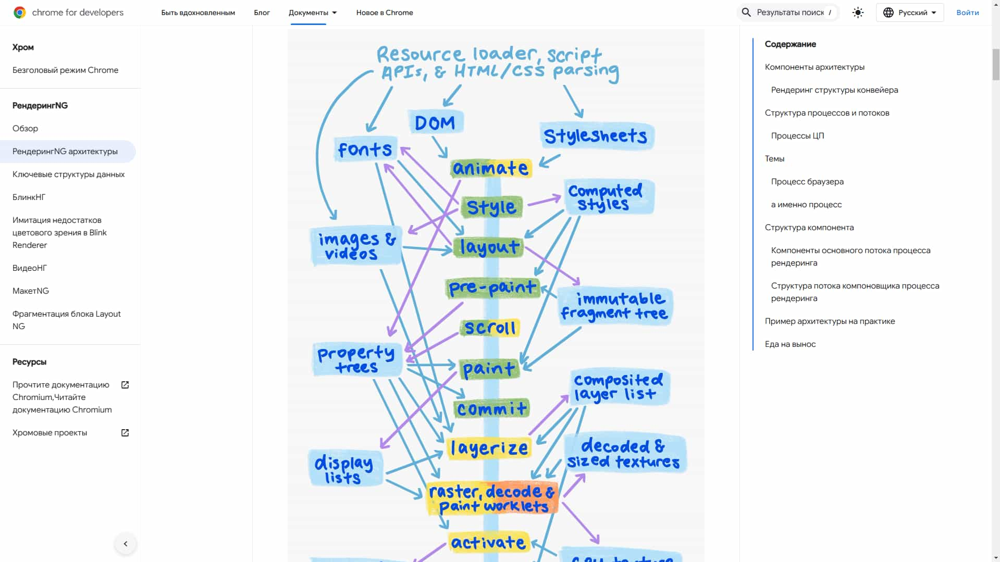
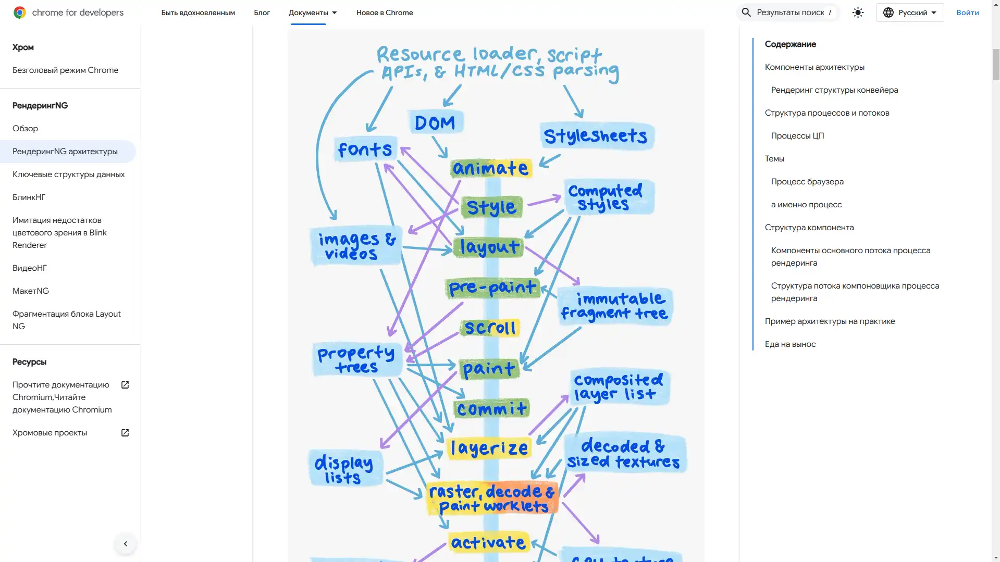

# Workshop 1

## 1. Опис вихідних зображень

Нижче наведена інформація про три вихідні зображення:

1. **image.jpg**

   - Роздільна здатність: `3840 x 2160`
   - Формат: `JPEG`
   - Вага файлу: `1.7 МБ`

2. **screenshot.png**

   - Роздільна здатність: `1919 x 1079`
   - Формат: `PNG`
   - Вага файлу: `286 КБ`

3. **text.png**
   - Роздільна здатність: `1919 x 1079`
   - Формат: `PNG`
   - Вага файлу: `0.98 МБ`

## 2. Стиснення без втрати якості (Lossless)

### 2.1 PNG (lossless) та WebP (lossless)

| Зображення         | Початкове (розмір / вага) | PNG (lossless) вага | WebP (lossless) вага |
| ------------------ | ------------------------- | ------------------- | -------------------- |
| **image.jpg**      | `3840 x 2160 / 1.7 МБ`    | `8.21 МБ`           | `4.13 МБ`            |
| **screenshot.png** | `1919 x 1079 / 286 КБ`    | `202 КБ`            | `82.3 КБ`            |
| **text.png**       | `1919 x 1079 / 0.98 МБ`   | `1 МБ`              | `632 КБ`             |

> Візуально якість не змінилася, але стиснення зображення з уже стиснутого JPEG у PNG чи WebP (lossless) найчастіше призводить до збільшення розміру файлу.

## 3. Стиснення з втратою якості (Lossy)

### 3.1 MozJPEG, WebP (lossy), AVIF

Нижче таблиця для показників якості 100%, 75% та 50%.

| Зображення         | MozJPEG 100% | MozJPEG 75% | MozJPEG 50% | WebP 100% | WebP 75% | WebP 50%  | AVIF 100% | AVIF 75%  | AVIF 50%  |
| :----------------- | :----------- | :---------- | :---------- | :-------- | :------- | :-------- | :-------- | :-------- | :-------- |
| **image.jpg**      | `2.17 МБ`    | `365 КБ`    | `220 КБ`    | `1.34 МБ` | `225 КБ` | `161 КБ`  | `1.45 МБ` | `293 КБ`  | `115 КБ`  |
| **screenshot.png** | `478 КБ`     | `113 КБ`    | `30.7 КБ`   | `131 КБ`  | `58 КБ`  | `50 КБ`   | `65.2 КБ` | `30.7 КБ` | `18.8 КБ` |
| **text.png**       | `666 КБ`     | `138 КБ`    | `93.4 КБ`   | `301 КБ`  | `107 КБ` | `85.7 КБ` | `321 КБ`  | `124 КБ`  | `69.4 КБ` |

> Найменший прийнятний розмір, відрізняється залежно від того, де використовуватиметься зображення. Наприклад, **MozJPEG/WebP/AVIF 75%** зазвичай достатньо для збереження гарної якості та значного зменшення ваги. У деяких випадках навіть 50% виглядає прийнятно, якщо невелике погіршення якості не критичне.

## 4. Оптимізація розміру відповідно до цільового використання

### 4.1 Розміри для вебу та мобільних пристроїв

Макс. ширина для вебу: `1200px`  
Макс. ширина для мобільних пристроїв: `600px`

| Зображення         | Початкова розд. здатність / вага | Веб (макс. 1200px)    | Мобільна (макс. 600px) |
| ------------------ | -------------------------------- | --------------------- | ---------------------- |
| **image.jpg**      | `3840 x 2160 / 1.7 МБ`           | `1200 x 675 / 249 КБ` | `600 x 338 / 72.5 КБ`  |
| **screenshot.png** | `1919 x 1079 / 286 КБ`           | `1200 x 675 / 129 КБ` | `600 x 338 / 61.7 КБ`  |
| **text.png**       | `1919 x 1079 / 0.98 МБ`          | `1200 x 675 / 426 КБ` | `600 x 338 / 125 КБ`   |

### 4.2 Адаптація під Retina-дисплеї

Нижче приклади версій 2x або 3x.

| Зображення         | Версія 2x/3x (розд. здатність) | Підсумкова вага |
| ------------------ | ------------------------------ | --------------- |
| **image.jpg**      | `7680 x 4320`                  | `4.23 МБ`       |
| **screenshot.png** | `5760 x 3240`                  | `1.14 МБ`       |
| **text.png**       | `5760 x 3240`                  | `5.34 МБ`       |

## 5. Візуальний аналіз та висновки

### 5.1 Порівняння вихідних та всіх оптимізованих зображень

Нижче представлені **всі** варіанти стиснення та зміни розміру для кожного вихідного зображення.

<strong>1. image.jpg</strong>

| Варіант              | Попередній перегляд                                          | Орієнтовна вага |
| -------------------- | ------------------------------------------------------------ | --------------- |
| **Original**         |                                | `1.7 МБ`        |
| **PNG (lossless)**   |      | `8.21 МБ`       |
| **WebP (lossless)**  |  | `4.13 МБ`       |
| **MozJPEG 100%**     |                        | `2.17 МБ`       |
| **MozJPEG 75%**      |                          | `365 КБ`        |
| **MozJPEG 50%**      |                          | `220 КБ`        |
| **WebP 100%**        |                      | `1.34 МБ`       |
| **WebP 75%**         |                        | `225 КБ`        |
| **WebP 50%**         |                        | `161 КБ`        |
| **AVIF 100%**        |                      | `1.45 МБ`       |
| **AVIF 75%**         |                        | `293 КБ`        |
| **AVIF 50%**         |                        | `115 КБ`        |
| **Resized (1200px)** |                  | `249 КБ`        |
| **Resized (600px)**  |                    | `72.5 КБ`       |
| **Retina 2x**        |                          | `4.23 МБ`       |

<strong>2. screenshot.png</strong>

| Варіант              | Попередній перегляд                                                    | Орієнтовна вага |
| -------------------- | ---------------------------------------------------------------------- | --------------- |
| **Original**         |                                | `286 КБ`        |
| **PNG (lossless)**   |      | `202 КБ`        |
| **WebP (lossless)**  |  | `82.3 КБ`       |
| **MozJPEG 100%**     |                        | `478 КБ`        |
| **MozJPEG 75%**      |                          | `113 КБ`        |
| **MozJPEG 50%**      |                          | `30.7 КБ`       |
| **WebP 100%**        |                      | `131 КБ`        |
| **WebP 75%**         |                        | `58 КБ`         |
| **WebP 50%**         |                        | `50 КБ`         |
| **AVIF 100%**        |                      | `65.2 КБ`       |
| **AVIF 75%**         |                        | `30.7 КБ`       |
| **AVIF 50%**         |                        | `18.8 КБ`       |
| **Resized (1200px)** |                  | `129 КБ`        |
| **Resized (600px)**  |                    | `61.7 КБ`       |
| **Retina 3x**        |                          | `1.14 МБ`       |

<strong>3. text.png</strong>

| Варіант              | Попередній перегляд                                        | Орієнтовна вага |
| -------------------- | ---------------------------------------------------------- | --------------- |
| **Original**         |                                | `0.98 МБ`       |
| **PNG (lossless)**   |      | `1 МБ`          |
| **WebP (lossless)**  |  | `632 КБ`        |
| **MozJPEG 100%**     |                        | `666 КБ`        |
| **MozJPEG 75%**      |                          | `138 КБ`        |
| **MozJPEG 50%**      |                          | `93.4 КБ`       |
| **WebP 100%**        |                      | `301 КБ`        |
| **WebP 75%**         |                        | `107 КБ`        |
| **WebP 50%**         |                        | `85.7 КБ`       |
| **AVIF 100%**        |                      | `321 КБ`        |
| **AVIF 75%**         |                        | `124 КБ`        |
| **AVIF 50%**         |                        | `69.4 КБ`       |
| **Resized (1200px)** |                  | `426 КБ`        |
| **Resized (600px)**  |                    | `125 КБ`        |
| **Retina 3x**        |                          | `5.34 МБ`       |

### 5.2 Загальні висновки

1. **Який формат і параметри оптимізації найкраще підійшли для кожного типу зображення?**

   - **Фото (image.jpg)**:  
     Найкраще співвідношення якість/розмір дають WebP 75%, AVIF 75% або MozJPEG 75%. AVIF іноді ефективніший, але менш поширений. WebP 50% ще більше зменшує вагу, проте може з’явитися помітний шум і втрата деталей.
   - **Скріншот (screenshot.png)**:  
     Оскільки це переважно графіка з текстом, PNG (lossless) можна використовувати, якщо важлива відсутність артефактів. Але WebP/AVIF також чудово стискають за якості 75–100%, майже не погіршуючи чіткість. При сильнішому стисненні (50%) текст може розмиватися.
   - **Текстові/графічні зображення (text.png)**:  
     Якщо потрібна чітка передача шрифтів, залишають PNG (lossless). Проте WebP/AVIF при якості 75–100% можуть суттєво зменшити вагу майже без помітної втрати.

2. **Як зміна розміру впливає на оптимізацію?**  
   Зменшення ширини до 1200px чи 600px дає суттєву економію у вазі файлу. Часто це навіть більш відчутне зниження розміру, ніж перехід з 100% до 75% якості за того ж розміру. Для вебу й мобільних пристроїв важливо підібрати роздільну здатність, щоб не перевантажувати трафік.

3. **Як правильно адаптувати зображення під Retina-дисплеї?**  
   Для Retina (2x, 3x) створюють версії з більшим розміром, але без належного стиснення файли можуть бути надмірно великими. Зазвичай використовують оптимізовану (стиснуту) версію в оригінальній роздільній здатності. 2x / 3x версію (знову ж стиснену) тільки для пристроїв, здатних відображати таку якість.
